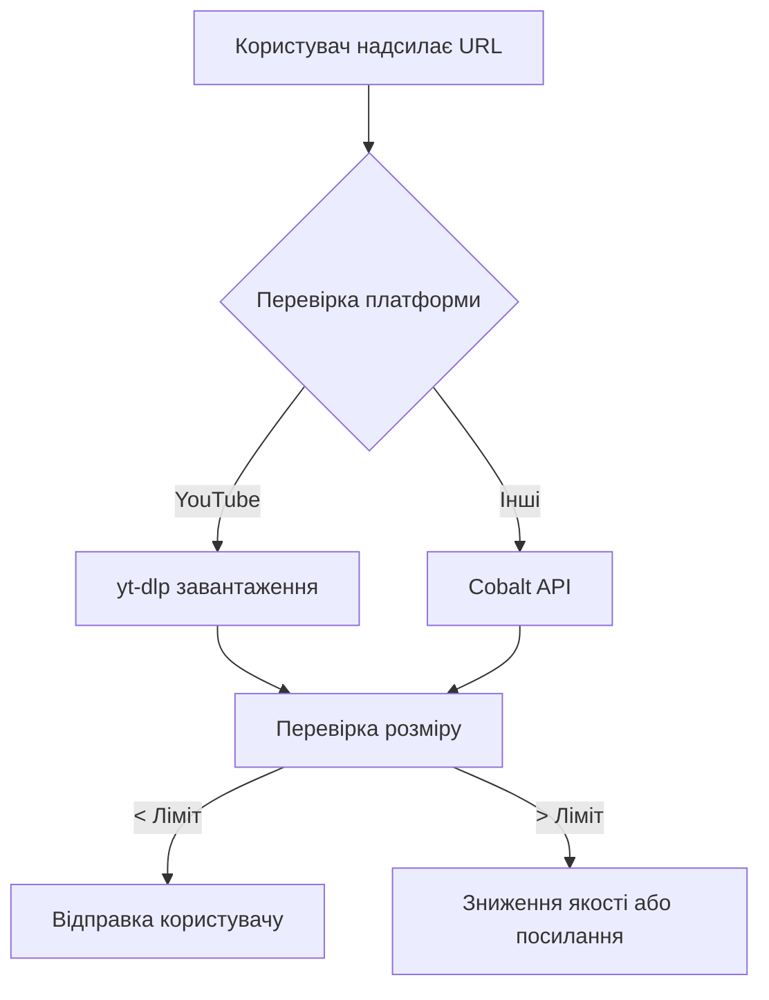

# 🎬 Zavantazhuvator Bot

Telegram бот для завантаження відео з 20+ популярних платформ з підтримкою файлів до 2 ГБ!

## 🚀 Можливості

- ✅ **YouTube** - до 1080p через yt-dlp з оригінальним аудіо
- ✅ **20+ платформ** через Cobalt API - TikTok, Instagram, Twitter, Reddit, Vimeo та інші
- ✅ **Якість до 4K/8K** для підтримуваних платформ
- ✅ **Файли до 2 ГБ** при використанні локального Bot API Server
- ✅ **JWT аутентифікація** для Cobalt API
- ✅ **Каруселі та слайдшоу** (Instagram альбоми, TikTok)
- ✅ **Оригінальна аудіодоріжка** без перекладу

## 📦 Встановлення

1. **Клонуйте репозиторій:**
```bash
git clone https://github.com/cmpdchtr/Zavantazhuvator.git
cd Zavantazhuvator
```

2. **Створіть віртуальне оточення:**
```bash
python -m venv venv
venv\Scripts\activate  # Windows
# або
source venv/bin/activate  # Linux/Mac
```

3. **Встановіть залежності:**
```bash
pip install -r requirements.txt
```

4. **Створіть `.env` файл:**
```env
BOT_TOKEN="ваш_телеграм_бот_токен"
COBALT_API_URL="https://cobalt-api.kwiatekmiki.com"
```

5. **Запустіть бота:**
```bash
python main.py
```

## 🚀 Збільшення ліміту до 2 ГБ

За замовчуванням Telegram Bot API має ліміт **50 МБ**. Але ви можете запустити локальний Bot API Server і отримати ліміт **2 ГБ**!

### Швидкий старт з Docker:

```bash
docker run -d \
  --name telegram-bot-api \
  -p 8081:8081 \
  -e TELEGRAM_API_ID=YOUR_API_ID \
  -e TELEGRAM_API_HASH=YOUR_API_HASH \
  aiogram/telegram-bot-api:latest
```

**Отримайте API ID та Hash:** https://my.telegram.org/auth

Потім додайте в `.env`:
```env
BOT_API_SERVER="http://localhost:8081"
```

**📖 Детальна інструкція:** [LOCAL_BOT_API_SETUP.md](LOCAL_BOT_API_SETUP.md)

## ⚙️ Налаштування

### Базова конфігурація (.env)

```env
# Обов'язково
BOT_TOKEN="your_bot_token_here"

# Локальний Bot API (опціонально, для файлів до 2 ГБ)
BOT_API_SERVER="http://localhost:8081"

# Cobalt API
COBALT_API_URL="https://cobalt-api.kwiatekmiki.com"

# API ключ (опціонально)
COBALT_API_KEY="your_api_key_here"
```

### Альтернативні Cobalt інстанси

```env
COBALT_API_URL="https://api.cobalt.tools"
COBALT_API_URL="https://co.wuk.sh"
COBALT_API_URL="https://cobalt-api.kwiatekmiki.com"
```

## 📱 Підтримувані платформи

### YouTube (через yt-dlp)
- ✅ Якість до 1080p
- ✅ Оригінальне аудіо
- ✅ Автоматичне зниження якості при великому розмірі

### Інші платформи (через Cobalt API)
**Соціальні мережі:**
- TikTok
- Instagram (пости, reels, stories, каруселі)
- Twitter/X
- Reddit
- Facebook

**Відео платформи:**
- Vimeo
- Dailymotion
- Twitch (кліпи)
- Streamable

**Інші:**
- Tumblr
- Pinterest
- Vine
- Bilibili
- Douyin
- VK Video
- OK.ru
- Rutube

## 🎯 Використання

1. Запустіть бота
2. Надішліть `/start` щоб побачити інформацію
3. Відправте посилання на відео
4. Отримайте відео у високій якості!

## 📊 Як це працює



## 🔧 Налагодження

### Проблеми з Cobalt API

**401/403 помилки:**
- Спробуйте інший інстанс у `.env`
- Перевірте логи для деталей

**Тайм-аути:**
- Збільшіть timeout у коді
- Спробуйте інший інстанс

### Проблеми з YouTube

**Відео не завантажується:**
- Оновіть yt-dlp: `pip install -U yt-dlp`
- Перевірте чи відео доступне

**Повільне завантаження:**
- Це нормально для великих відео
- Розгляньте локальний Bot API

## 🤝 Внесок

Pull requests вітаються! Для великих змін спочатку створіть issue.

## 📄 Ліцензія

MIT License - дивіться [LICENSE](LICENSE)

## 🤫 Більше крутих ботів

Приєднуйтесь до [@cmpdchtr_bots](https://t.me/cmpdchtr_bots)

---

**Розроблено з ❤️ для спільноти**
